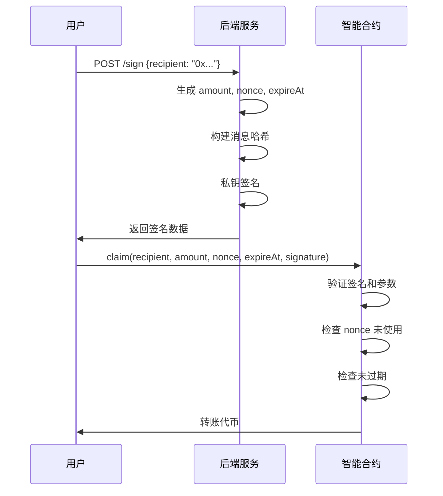

# Airdrop Signer 后端服务分析

## 项目概述

`airdrop-signer` 是一个基于 Node.js + TypeScript 开发的签名服务，专门为基于签名的空投系统提供后端支持。该服务的主要功能是为符合条件的用户生成空投签名，配合 `SignatureDrop.sol` 智能合约使用。

## 项目架构

### 📁 目录结构
```
airdrop-signer/
├── .gitignore              # Git 忽略文件
├── node_modules/           # 依赖包目录
├── package.json            # 项目配置文件
├── package-lock.json       # 依赖锁定文件
├── tsconfig.json          # TypeScript 配置
└── src/
    └── index.ts           # 主服务文件
```

### 🛠️ 技术栈

| 技术 | 版本 | 用途 |
|------|------|------|
| **运行时环境** |
| Node.js | - | JavaScript 运行环境 |
| TypeScript | ^5.6.3 | 类型安全的 JavaScript |
| **框架和库** |
| Express | ^4.21.1 | Web 框架 |
| Viem | ^2.21.43 | 以太坊交互库 |
| dotenv | ^16.4.5 | 环境变量管理 |
| **开发工具** |
| nodemon | ^3.1.7 | 开发时自动重启 |
| ts-node | ^10.9.2 | TypeScript 直接执行 |

## 核心功能分析

### 🔐 钱包管理

```typescript
// 从环境变量加载私钥
const privateKey = process.env.PRIVATE_KEY;

// 创建钱包账户
const account = privateKeyToAccount(`0x${privateKey}`);

// 创建钱包客户端
const client = createWalletClient({
  account,
  chain: sepolia,          // 使用 Sepolia 测试网
  transport: http(),
});
```

**功能说明：**
- 使用私钥创建签名账户
- 连接到 Sepolia 测试网络
- 提供消息签名能力

### 🎯 签名 API 接口

#### POST `/sign`

**请求格式：**
```typescript
interface SignRequest {
  recipient: string;  // 接收者地址
}
```

**响应格式：**
```typescript
interface SignResponse {
  amount: string;     // 空投金额
  nonce: number;      // 防重放攻击的随机数
  expireAt: number;   // 签名过期时间戳
  signature: string;  // 数字签名
}
```

**处理流程：**
1. **地址验证**: 检查接收者地址格式
2. **金额计算**: 随机生成 1-10000 的空投金额
3. **参数生成**: 
   - `nonce`: 全局递增的唯一标识符
   - `expireAt`: 当前时间 + 24小时
4. **消息构建**: 使用 `encodePacked` 打包参数
5. **签名生成**: 使用私钥对消息哈希进行签名
6. **响应返回**: 返回所有必要参数和签名

### 🔒 消息哈希构建

```typescript
function getMessageHash(
  recipient: string,
  amount: string, 
  nonce: number,
  expireAt: number
): string {
  const types = ["address", "uint256", "uint256", "uint256"];
  const values = [recipient, amount, nonce, expireAt];
  
  const packedData = encodePacked(types, values);
  const messageHash = keccak256(packedData);
  
  return messageHash;
}
```

**安全特性：**
- 使用标准的 `encodePacked` 编码
- 包含防重放攻击的 `nonce`
- 包含时间限制的 `expireAt`
- 使用 `keccak256` 哈希算法

### 💰 空投金额策略

```typescript
function getAmount(recipient: string): string {
  const min = 1;
  const max = 10000;
  const randomAmount = Math.floor(Math.random() * (max - min + 1)) + min;
  return randomAmount.toString();
}
```

**当前实现：**
- 随机分配 1-10000 之间的金额
- 不考虑用户历史或资格

**生产环境建议：**
```typescript
// 建议的实现方式
function getAmount(recipient: string): string {
  // 1. 查询用户资格
  const userTier = getUserTier(recipient);
  
  // 2. 根据不同等级分配不同金额
  switch(userTier) {
    case 'VIP': return '10000';
    case 'PREMIUM': return '5000';
    case 'BASIC': return '1000';
    default: return '0';
  }
}
```

## 安全性分析

### ✅ 安全优势

1. **私钥保护**
   - 私钥存储在环境变量中
   - 不在代码中硬编码敏感信息

2. **防重放攻击**
   - 使用递增的 `nonce` 防止签名重用
   - 每个签名都有唯一标识

3. **时间限制**
   - 签名有 24 小时有效期
   - 防止签名被长期滥用

4. **地址验证**
   - 使用 `isAddress` 验证地址格式
   - 防止无效地址请求

### ⚠️ 安全风险

1. **Nonce 管理**
   ```typescript
   // 当前问题：内存存储，服务重启会重置
   let currentNonce = 0;
   
   // 建议改进：持久化存储
   import Redis from 'redis';
   const redis = Redis.createClient();
   
   async function getNextNonce(): Promise<number> {
     return await redis.incr('airdrop:nonce');
   }
   ```

2. **无认证机制**
   ```typescript
   // 当前问题：任何人都可以请求签名
   
   // 建议改进：添加认证
   app.use('/sign', authenticateUser);
   
   function authenticateUser(req, res, next) {
     // 验证用户身份
     // 检查白名单
     // 限制请求频率
   }
   ```

3. **缺少速率限制**
   ```typescript
   // 建议添加：
   import rateLimit from 'express-rate-limit';
   
   const limiter = rateLimit({
     windowMs: 15 * 60 * 1000, // 15分钟
     max: 5, // 最多5次请求
   });
   
   app.use('/sign', limiter);
   ```

## 与智能合约的集成

### 合约端验证

在 `SignatureDrop.sol` 中，签名验证过程：

```solidity
function claim(
    address recipient,
    uint256 amount,
    uint256 nonce,
    uint256 expireAt,
    bytes calldata signature
) external {
    // 1. 检查过期时间
    require(block.timestamp <= expireAt, "Signature expired");
    
    // 2. 检查 nonce 是否已使用
    require(!nonceUsed[nonce], "Nonce already used");
    
    // 3. 重建消息哈希
    bytes32 messageHash = getMessageHash(recipient, amount, nonce, expireAt);
    bytes32 ethSignedMessageHash = MessageHashUtils.toEthSignedMessageHash(messageHash);
    
    // 4. 验证签名
    address signer = ECDSA.recover(ethSignedMessageHash, signature);
    require(signer == signerAddress, "Invalid signature");
    
    // 5. 标记 nonce 已使用
    nonceUsed[nonce] = true;
    
    // 6. 执行转账
    IERC20(token).safeTransfer(recipient, amount);
}
```

### 完整的交互流程



## 部署和运行

### 环境配置

1. **创建 `.env` 文件**
```bash
# .env
PRIVATE_KEY=你的私钥（不包含0x前缀）
PORT=8080
```

2. **安装依赖**
```bash
npm install
```

3. **开发模式运行**
```bash
npm run dev
```

4. **生产模式部署**
```bash
npm run build
npm start
```

### Docker 部署（建议）

```dockerfile
# Dockerfile
FROM node:18-alpine

WORKDIR /app

COPY package*.json ./
RUN npm ci --only=production

COPY dist ./dist

EXPOSE 8080

CMD ["node", "dist/index.js"]
```

## 测试示例

### 使用 curl 测试

```bash
# 请求签名
curl -X POST http://localhost:8080/sign \
  -H "Content-Type: application/json" \
  -d '{"recipient": "0x1956b2c4C511FDDd9443f50b36C4597D10cD9985"}'

# 响应示例
{
  "amount": "5432",
  "nonce": 1,
  "expireAt": 1732234567,
  "signature": "0x1234567890abcdef..."
}
```

### 前端集成示例

```typescript
// 前端代码示例
async function requestAirdrop(userAddress: string) {
  try {
    // 1. 请求后端签名
    const response = await fetch('http://localhost:8080/sign', {
      method: 'POST',
      headers: {
        'Content-Type': 'application/json',
      },
      body: JSON.stringify({
        recipient: userAddress
      })
    });
    
    const signData = await response.json();
    
    // 2. 调用智能合约
    const contract = new Contract(contractAddress, abi, signer);
    const tx = await contract.claim(
      signData.recipient,
      signData.amount,
      signData.nonce,
      signData.expireAt,
      signData.signature
    );
    
    await tx.wait();
    console.log('空投成功！');
    
  } catch (error) {
    console.error('空投失败：', error);
  }
}
```

## 生产环境优化建议

### 1. 数据库集成

```typescript
// 使用 PostgreSQL 存储用户资格和历史
import { Pool } from 'pg';

const pool = new Pool({
  connectionString: process.env.DATABASE_URL,
});

async function getUserEligibility(address: string) {
  const result = await pool.query(
    'SELECT tier, claimed FROM users WHERE address = $1',
    [address]
  );
  return result.rows[0];
}
```

### 2. Redis 缓存

```typescript
// 使用 Redis 存储 nonce 和速率限制
import Redis from 'ioredis';

const redis = new Redis(process.env.REDIS_URL);

async function getNextNonce(): Promise<number> {
  return await redis.incr('airdrop:global:nonce');
}

async function checkRateLimit(address: string): Promise<boolean> {
  const key = `rate_limit:${address}`;
  const current = await redis.incr(key);
  
  if (current === 1) {
    await redis.expire(key, 3600); // 1小时
  }
  
  return current <= 5; // 每小时最多5次
}
```

### 3. 监控和日志

```typescript
import winston from 'winston';

const logger = winston.createLogger({
  level: 'info',
  format: winston.format.json(),
  transports: [
    new winston.transports.File({ filename: 'airdrop.log' })
  ]
});

// 记录每次签名请求
app.post('/sign', async (req, res) => {
  logger.info('Sign request', {
    recipient: req.body.recipient,
    timestamp: new Date().toISOString(),
    ip: req.ip
  });
  
  // ... 处理逻辑
});
```

### 4. 健康检查

```typescript
app.get('/health', (req, res) => {
  res.json({
    status: 'healthy',
    timestamp: new Date().toISOString(),
    signerAddress: account.address,
    network: 'sepolia'
  });
});
```

## 总结

### 优点 ✅
- **架构清晰**: 单一职责，专注于签名生成
- **类型安全**: 使用 TypeScript 提供类型检查
- **现代技术栈**: 使用最新的 Viem 库
- **易于部署**: 简单的 Express 应用

### 改进空间 🔄
- **持久化存储**: nonce 和用户数据需要数据库支持
- **认证授权**: 需要添加用户身份验证
- **速率限制**: 防止滥用和攻击
- **监控日志**: 生产环境需要完善的监控
- **错误处理**: 需要更详细的错误分类和处理

### 适用场景 🎯
- **小规模空投**: 适合测试和小规模项目
- **灵活分配**: 可以根据复杂规则动态分配金额
- **实时签名**: 用户请求时实时生成签名
- **细粒度控制**: 可以精确控制每个用户的空投金额

这个后端服务为基于签名的空投提供了一个很好的起点，可以根据具体需求进行扩展和优化。

---

**分析完成时间**: 2025年9月21日  
**服务版本**: 基于 Express 4.21.1 + Viem 2.21.43
