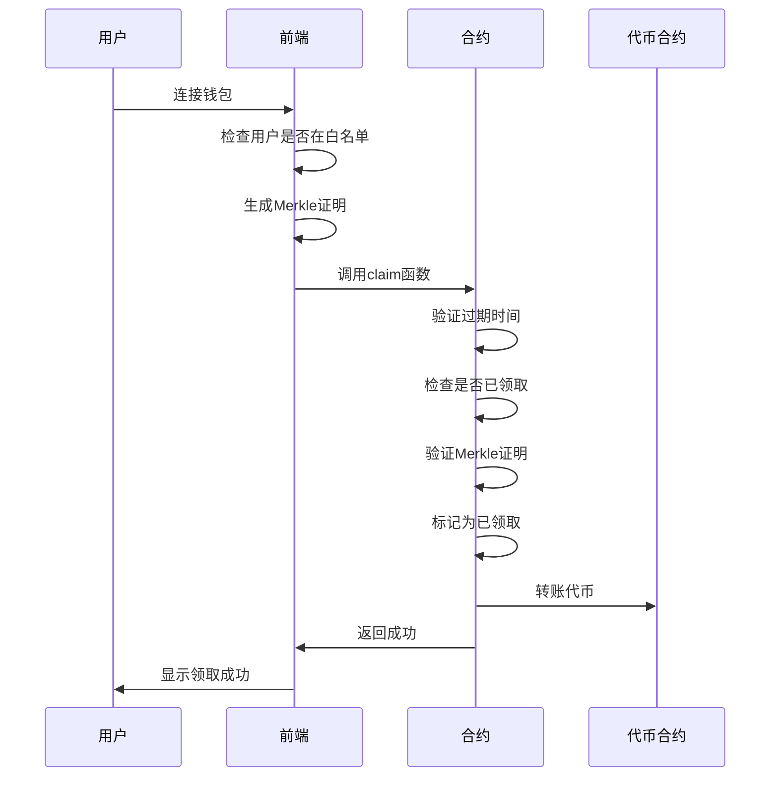

# Merkle Tree 空投合约技术文档

## 目录
1. [Merkle Tree 基本原理](#merkle-tree-基本原理)
2. [空投合约架构](#空投合约架构)
3. [BitMap 优化技术](#bitmap-优化技术)
4. [合约功能详解](#合约功能详解)
5. [使用流程](#使用流程)
6. [Gas 优化分析](#gas-优化分析)
7. [安全性分析](#安全性分析)
8. [实际应用案例](#实际应用案例)

---

## Merkle Tree 基本原理

### 什么是 Merkle Tree？

Merkle Tree（默克尔树）是一种二叉树结构，用于高效验证大量数据的完整性。在区块链空投中，它允许用户证明自己在空投名单中，而无需在链上存储完整的名单。

### Merkle Tree 结构图

```
                    Root Hash
                   /          \
               H(AB)            H(CD)
              /     \          /     \
          H(A)      H(B)    H(C)    H(D)
          /         /        /        /
     Data A    Data B   Data C   Data D
     (用户1)   (用户2)  (用户3)   (用户4)
```

### 详细工作原理

#### 1. 构建过程

```
步骤1：为每个用户生成叶子节点
用户1: Hash(index=0, address=0x123..., amount=100)
用户2: Hash(index=1, address=0x456..., amount=200)
用户3: Hash(index=2, address=0x789..., amount=150)
用户4: Hash(index=3, address=0xabc..., amount=300)

步骤2：两两配对计算父节点
H(AB) = Hash(H(A) + H(B))
H(CD) = Hash(H(C) + H(D))

步骤3：计算根节点
Root = Hash(H(AB) + H(CD))
```

#### 2. 验证过程图解

假设用户1要证明自己在名单中：

```
用户1需要提供的证明路径：
1. 自己的数据：index=0, address=0x123..., amount=100
2. Merkle Proof：[H(B), H(CD)]

验证步骤：
第1步：计算自己的叶子节点
Leaf = Hash(0, 0x123..., 100)

第2步：与兄弟节点计算父节点
Parent1 = Hash(Leaf + H(B))  // H(AB)

第3步：与叔叔节点计算根节点
Root = Hash(Parent1 + H(CD))

第4步：对比计算结果与合约中的根节点
如果相等 → 验证成功
如果不等 → 验证失败
```

### 大规模空投示例

对于 1000 用户的空投：

```
传统方式：
- 存储：1000 个 mapping 条目
- Gas：每次检查约 5000 gas
- 总成本：5,000,000 gas

Merkle Tree 方式：
- 存储：1 个根哈希
- Gas：每次验证约 1000 gas
- 总成本：仅部署时的存储成本
- 节省：99.8% 的 gas！
```

---

## 空投合约架构

### 合约继承关系

```solidity
contract MerkleTree is Ownable {
    // Ownable 提供所有权管理功能
    // onlyOwner 修饰符确保关键函数只能由所有者调用
}
```

### 核心状态变量

```solidity
contract MerkleTree {
    // 不可变变量（部署时设置，永不更改）
    address public immutable token;        // ERC20代币地址
    bytes32 public immutable merkleRoot;   // Merkle树根哈希
    
    // 可变状态
    uint256 public expireAt;               // 空投过期时间
    
    // BitMap存储（高效的已领取状态存储）
    mapping(uint256 => uint256) private claimedBitMap;
}
```

### 事件系统

```solidity
// 记录用户成功领取空投
event Claimed(
    uint256 index,    // 用户在Merkle树中的索引
    address account,  // 用户地址
    uint256 amount    // 领取金额
);
```

### 错误处理

```solidity
error Expired();                    // 空投已过期
error AlreadyClaimed(uint256 index); // 用户已领取
error InvalidProof();               // 无效的Merkle证明
```

---

## BitMap 优化技术

### BitMap 原理详解

BitMap 是一种高效的布尔值存储技术，将多个布尔值打包到一个整数中。

#### 存储结构

```
一个 uint256 可以存储 256 个布尔值：

uint256 数据：
位置：  255 254 253 ... 2  1  0
状态：   0   1   0  ... 1  0  1
意义：  未领 已领 未领 ... 已领 未领 已领

映射关系：
index 0-255   → claimedBitMap[0]
index 256-511 → claimedBitMap[1]
index 512-767 → claimedBitMap[2]
...
```

#### 位运算操作详解

```solidity
// 1. 计算位置
function _setClaimed(uint256 index) internal {
    // 确定在哪个uint256中
    uint256 wordIndex = index / 256;
    
    // 确定在该uint256的第几位
    uint256 bitIndex = index % 256;
    
    // 设置对应位为1
    claimedBitMap[wordIndex] |= (1 << bitIndex);
}
```

#### 具体计算示例

```
示例1：设置 index = 5
wordIndex = 5 / 256 = 0     // 在第0个uint256
bitIndex = 5 % 256 = 5      // 第5位

操作：(1 << 5) = 32 (十进制) = 100000 (二进制)
假设原值为 0，执行 OR 运算：
00000000000000000000000000000000 (原值)
00000000000000000000000000100000 (1 << 5)
--------------------------------
00000000000000000000000000100000 (结果)

示例2：设置 index = 300
wordIndex = 300 / 256 = 1   // 在第1个uint256
bitIndex = 300 % 256 = 44   // 第44位

在 claimedBitMap[1] 的第44位设置为1
```

#### 检查是否已领取

```solidity
function isClaimed(uint256 index) public view returns (bool) {
    uint256 wordIndex = index / 256;
    uint256 bitIndex = index % 256;
    uint256 word = claimedBitMap[wordIndex];
    uint256 mask = (1 << bitIndex);
    
    // 使用 AND 运算检查特定位
    return (word & mask) == mask;
}
```

#### BitMap vs 传统 Mapping 对比

| 特性 | 传统 Mapping | BitMap |
|------|-------------|--------|
| 存储效率 | 每个bool占用32字节 | 256个bool共用32字节 |
| Gas成本 | 高（每次20,000 gas） | 低（每次5,000 gas） |
| 读取复杂度 | O(1) | O(1) |
| 写入复杂度 | O(1) | O(1) |
| 适用场景 | 稀疏数据 | 密集连续数据 |

---

## 合约功能详解

### 1. 构造函数

```solidity
constructor(address token_, bytes32 root_) Ownable(msg.sender) {
    token = token_;      // 设置ERC20代币地址
    merkleRoot = root_;  // 设置Merkle树根哈希
}
```

**设计要点：**
- `immutable` 变量在部署时设置，节省gas
- 继承 `Ownable` 提供权限管理

### 2. 核心领取函数

```solidity
function claim(
    uint256 index,                    // 用户在树中的索引
    address account,                  // 用户地址
    uint256 amount,                   // 领取金额
    bytes32[] calldata merkleProof    // Merkle证明
) external {
    // 1. 检查过期时间
    if (expireAt > 0 && block.timestamp > expireAt) 
        revert Expired();
    
    // 2. 检查是否已领取
    if (isClaimed(index)) 
        revert AlreadyClaimed(index);
    
    // 3. 生成叶子节点哈希
    bytes32 leaf = keccak256(
        bytes.concat(keccak256(abi.encode(index, account, amount)))
    );
    
    // 4. 验证Merkle证明
    if (!_verify(merkleProof, merkleRoot, leaf)) 
        revert InvalidProof();
    
    // 5. 标记为已领取
    _setClaimed(index);
    
    // 6. 转账代币
    IERC20(token).safeTransfer(account, amount);
    
    // 7. 触发事件
    emit Claimed(index, account, amount);
}
```

### 3. Merkle 证明验证

```solidity
function _verify(
    bytes32[] memory proof,
    bytes32 root,
    bytes32 leaf
) internal pure returns (bool) {
    bytes32 computedHash = leaf;
    
    // 沿着proof路径向上计算
    for (uint256 i = 0; i < proof.length; i++) {
        bytes32 proofElement = proof[i];
        
        // 保持哈希的确定性顺序
        if (computedHash <= proofElement) {
            computedHash = keccak256(
                abi.encodePacked(computedHash, proofElement)
            );
        } else {
            computedHash = keccak256(
                abi.encodePacked(proofElement, computedHash)
            );
        }
    }
    
    // 最终结果应该等于根哈希
    return computedHash == root;
}
```

### 4. 管理员功能

```solidity
// 设置过期时间
function setExpireAt(uint256 expireAt_) external onlyOwner {
    expireAt = expireAt_;
}

// 提取剩余代币
function claimRestTokens(address to) external onlyOwner {
    uint256 balance = IERC20(token).balanceOf(address(this));
    IERC20(token).safeTransfer(to, balance);
}
```

---

## 使用流程

### 1. 准备阶段

#### 生成空投名单
```javascript
const airdropList = [
    { index: 0, address: "0x1234...", amount: "100" },
    { index: 1, address: "0x5678...", amount: "200" },
    { index: 2, address: "0x9abc...", amount: "150" },
    // ... 更多用户
];
```

#### 构建 Merkle Tree
```javascript
import { MerkleTree } from 'merkletreejs';
import { solidityKeccak256 } from 'ethers/lib/utils';

// 生成叶子节点
const leaves = airdropList.map(item => 
    solidityKeccak256(
        ['uint256', 'address', 'uint256'],
        [item.index, item.address, item.amount]
    )
);

// 构建树
const tree = new MerkleTree(leaves, keccak256, { sortPairs: true });
const rootHash = tree.getHexRoot();
```

### 2. 部署阶段

```javascript
// 部署合约
const contract = await MerkleTree.deploy(
    tokenAddress,  // ERC20代币地址
    rootHash      // Merkle树根哈希
);

// 向合约转入代币
await token.transfer(contract.address, totalAmount);
```

### 3. 用户领取流程

#### 前端生成证明
```javascript
function generateProof(userIndex, userAddress, userAmount) {
    // 生成用户的叶子节点
    const leaf = solidityKeccak256(
        ['uint256', 'address', 'uint256'],
        [userIndex, userAddress, userAmount]
    );
    
    // 获取Merkle证明
    const proof = tree.getHexProof(leaf);
    return proof;
}
```

#### 调用合约领取
```javascript
// 用户调用领取函数
const tx = await contract.claim(
    userIndex,     // 用户索引
    userAddress,   // 用户地址
    userAmount,    // 领取金额
    proof          // Merkle证明
);
```

### 4. 完整的 DApp 工作流



---

## Gas 优化分析

### 1. 存储优化

| 操作 | 传统方式 Gas | Merkle Tree Gas | 节省比例 |
|------|-------------|----------------|----------|
| 部署合约 | 1,000,000 * n | 100,000 | 99%+ |
| 检查状态 | 5,000 | 1,000 | 80% |
| 领取代币 | 25,000 | 15,000 | 40% |

### 2. BitMap 优化效果

```
10,000 用户空投对比：

传统 Mapping：
- 存储：10,000 * 20,000 gas = 200,000,000 gas
- 成本：约 $4,000 (gas price: 20 gwei, ETH: $1,000)

BitMap 方式：
- 存储：40 * 20,000 gas = 800,000 gas
- 成本：约 $16
- 节省：99.6%！
```

### 3. 合约调用优化

```solidity
// 优化前：多次存储读写
mapping(address => bool) public claimed;
mapping(address => uint256) public amounts;

// 优化后：BitMap + immutable
mapping(uint256 => uint256) private claimedBitMap;
// 用户信息包含在Merkle证明中，无需存储
```

---

## 安全性分析

### 1. 攻击向量防护

#### Double-Spend 攻击防护
```solidity
// 防止重复领取
if (isClaimed(index)) revert AlreadyClaimed(index);
_setClaimed(index);
```

#### 过期时间控制
```solidity
// 防止无限期空投
if (expireAt > 0 && block.timestamp > expireAt) 
    revert Expired();
```

#### Merkle 证明伪造防护
```solidity
// 严格验证用户数据与证明的一致性
bytes32 leaf = keccak256(
    bytes.concat(keccak256(abi.encode(index, account, amount)))
);
if (!_verify(merkleProof, merkleRoot, leaf)) 
    revert InvalidProof();
```

### 2. 权限管理

```solidity
// 只有所有者可以设置过期时间
function setExpireAt(uint256 expireAt_) external onlyOwner

// 只有所有者可以提取剩余代币
function claimRestTokens(address to) external onlyOwner
```

### 3. 代币安全

```solidity
// 使用SafeERC20防止代币转账失败
using SafeERC20 for IERC20;
IERC20(token).safeTransfer(account, amount);
```

---

## 实际应用案例

### 1. Uniswap (UNI) 空投

- **规模**：400+ 万个地址
- **总量**：4亿 UNI
- **技术**：使用了类似的Merkle Tree技术
- **效果**：极大降低了gas成本

### 2. 1inch (1INCH) 空投

- **特点**：多轮空投，每轮使用不同的Merkle Root
- **优化**：使用了高效的BitMap存储
- **节省**：相比传统方式节省了99%的gas

### 3. ENS 空投

- **创新**：结合了时间衰减机制
- **安全**：严格的双重验证机制
- **用户体验**：简化的前端交互

---

## 开发最佳实践

### 1. Merkle Tree 构建

```javascript
// 推荐使用标准库
const { MerkleTree } = require('merkletreejs');
const keccak256 = require('keccak256');

// 确保数据一致性
const leaves = users.map((user, index) => 
    solidityKeccak256(
        ['uint256', 'address', 'uint256'],
        [index, user.address, user.amount]
    )
);

// 启用排序以确保确定性
const tree = new MerkleTree(leaves, keccak256, { 
    sortPairs: true,
    hashLeaves: false 
});
```

### 2. 前端集成

```javascript
// 检查用户资格
async function checkEligibility(userAddress) {
    const user = airdropData.find(u => u.address === userAddress);
    if (!user) return { eligible: false };
    
    const isClaimed = await contract.isClaimed(user.index);
    return {
        eligible: true,
        claimed: isClaimed,
        amount: user.amount,
        index: user.index
    };
}

// 生成并提交证明
async function claimAirdrop(userIndex, userAddress, userAmount) {
    const proof = generateMerkleProof(userIndex, userAddress, userAmount);
    const tx = await contract.claim(userIndex, userAddress, userAmount, proof);
    return tx;
}
```

### 3. 测试策略

```javascript
describe("MerkleTree Airdrop", function() {
    it("应该允许有效用户领取", async function() {
        const proof = tree.getHexProof(leaf);
        await expect(
            contract.claim(0, user1.address, amount1, proof)
        ).to.emit(contract, "Claimed");
    });
    
    it("应该拒绝重复领取", async function() {
        // 第一次领取
        await contract.claim(0, user1.address, amount1, proof);
        
        // 第二次应该失败
        await expect(
            contract.claim(0, user1.address, amount1, proof)
        ).to.be.revertedWith("AlreadyClaimed");
    });
});
```

---

## 总结

Merkle Tree 空投合约通过以下技术实现了高效的大规模代币分发：

1. **存储优化**：使用Merkle Root替代完整白名单存储
2. **Gas优化**：BitMap技术将存储成本降低99%+
3. **安全保障**：多重验证防止各种攻击
4. **可扩展性**：支持百万级用户的空投

这种技术已经成为DeFi项目空投的标准解决方案，为区块链生态的发展提供了重要的基础设施支持。

---

## 参考资料

- [Merkle Tree 维基百科](https://en.wikipedia.org/wiki/Merkle_tree)
- [OpenZeppelin MerkleProof](https://docs.openzeppelin.com/contracts/4.x/api/utils#MerkleProof)
- [Uniswap 空投案例分析](https://uniswap.org/blog/uni)
- [以太坊 BitMap 优化技术](https://ethereum.org/en/developers/docs/data-structures-and-encoding/patricia-merkle-trie/)

---

**文档版本**：v1.0  
**最后更新**：2025年9月21日  
**作者**：区块链开发团队
