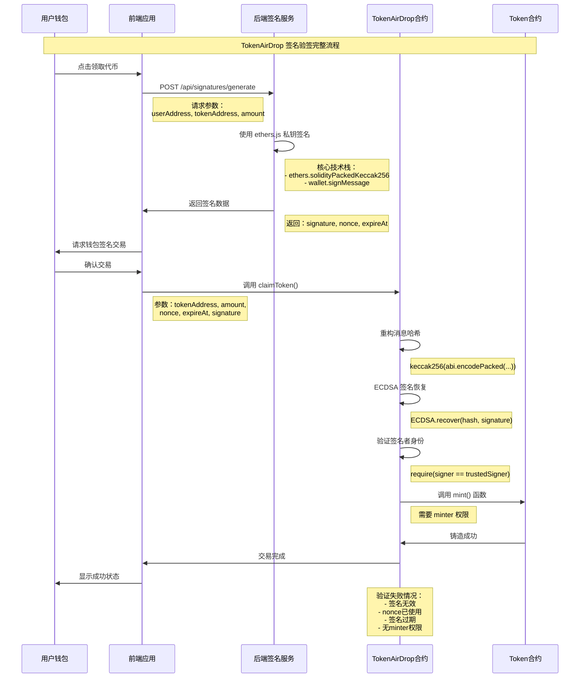

# TokenAirDrop 签名验签技术文档

## 📋 概述

本文档详细描述了 TokenAirDrop 系统中后端签名服务与智能合约验证之间的技术交互流程，包含核心代码分析、密码学原理说明和完整的签名验签架构。

## 🔄 签名验签流程图



## 💻 核心代码分析

### 后端签名服务 (signer.js)

```javascript
// 核心签名函数实现
const generateSignature = async (userAddress, tokenAddress, amount, expireAt) => {
  // 1. 生成唯一 nonce
  const nonce = Math.floor(Math.random() * 1000000000);
  
  // 2. 构造消息哈希 (与合约保持一致)
  const messageHash = ethers.solidityPackedKeccak256(
    ["address", "address", "uint256", "uint256", "uint256"],
    [userAddress, tokenAddress, amount, nonce, expireAt]
  );
  
  // 3. 使用私钥签名
  const signature = await wallet.signMessage(ethers.getBytes(messageHash));
  
  return { signature, nonce, expireAt };
};
```

**技术要点：**
- **ethers.js**: 使用 `solidityPackedKeccak256` 确保与 Solidity `abi.encodePacked` 一致
- **私钥管理**: 环境变量存储，生产环境需要 HSM 或密钥管理服务
- **消息哈希**: 包含所有关键参数防止重放攻击

### 智能合约验证 (TokenAirDrop.sol)

```solidity
// 核心验证函数实现
function claimToken(
    address tokenAddress,
    uint256 amount,
    uint256 nonce,
    uint256 expireAt,
    bytes memory signature
) external {
    // 1. 基础验证
    require(block.timestamp <= expireAt, "Signature expired");
    require(!nonceUsed[nonce], "Nonce already used");
    
    // 2. 重构消息哈希
    bytes32 messageHash = keccak256(abi.encodePacked(
        msg.sender,      // userAddress
        tokenAddress,
        amount,
        nonce,
        expireAt
    ));
    
    // 3. 转换为以太坊签名格式
    bytes32 ethSignedMessageHash = MessageHashUtils.toEthSignedMessageHash(messageHash);
    
    // 4. 恢复签名者地址
    address recoveredSigner = ECDSA.recover(ethSignedMessageHash, signature);
    
    // 5. 验证签名者身份
    require(recoveredSigner == signer, "Invalid signature");
    
    // 6. 标记nonce已使用
    nonceUsed[nonce] = true;
    
    // 7. 铸造代币
    MockToken(tokenAddress).mint(msg.sender, amount);
}
```

**技术要点：**
- **OpenZeppelin ECDSA**: 安全的签名恢复实现
- **MessageHashUtils**: 标准以太坊签名格式转换
- **防重放攻击**: nonce 机制确保签名只能使用一次
- **权限控制**: 需要在 Token 合约中授予 minter 权限

## 🔐 密码学原理详解

### ECDSA 数字签名算法

1. **签名生成** (后端)：
   ```
   私钥 + 消息哈希 → 数字签名
   signature = sign(privateKey, messageHash)
   ```

2. **签名验证** (合约)：
   ```
   数字签名 + 消息哈希 → 公钥地址
   publicAddress = recover(signature, messageHash)
   ```

### 消息哈希构造

```solidity
// Solidity 合约端
bytes32 messageHash = keccak256(abi.encodePacked(
    msg.sender,      // 0xa98C3E7B36d38Ce4f0c15d064a42a4846c979479
    tokenAddress,    // 0x550a3fc779b68919b378c1925538af7065a2a761
    amount,          // 1000000000000000000
    nonce,           // 280646034
    expireAt         // 1727089234
));
```

```javascript
// JavaScript 后端
const messageHash = ethers.solidityPackedKeccak256(
    ["address", "address", "uint256", "uint256", "uint256"],
    [userAddress, tokenAddress, amount, nonce, expireAt]
);
```

## 🏗️ 技术架构交互

### 系统组件

1. **后端签名服务**
   - 技术栈：Node.js + ethers.js
   - 职责：生成密码学签名
   - 私钥：`0x7ad968ae67253103d1357aefec508469e7e88a4566233b30f100exxxxxxxxx`
   - 对应地址：`0xa98C3E7B36d38Ce4f0c15d064a42a4xxxxx`

2. **智能合约验证**
   - 技术栈：Solidity + OpenZeppelin
   - 职责：验证签名有效性
   - 合约地址：`0x53850d0eb69feB0F2616e2A89AC9eFBE4A441569`
   - 可信签名者：`0xa98C3E7B36d38Ce4f0c15d064a42a4846c979479`

3. **前端应用**
   - 技术栈：React + wagmi + viem
   - 职责：用户交互和交易提交
   - 特点：不参与签名，只负责传递

### 安全机制

1. **时间限制**: `expireAt` 防止签名长期有效
2. **防重放**: `nonce` 机制确保签名唯一性
3. **权限控制**: 只有可信签名者的签名有效
4. **合约权限**: TokenAirDrop 需要 Token 合约的 minter 权限

## 🚨 关键安全注意事项

### 当前已知问题

1. **Minter 权限缺失**
   ```bash
   # WBTC 有权限 (可以领取)
   cast call 0x550a3fc779b68919b378c1925538af7065a2a761 \
     "hasRole(bytes32,address)" \
     0x9f2df0fed2c77648de5860a4cc508cd0818c85b8b8a1ab4ceeef8d981c8956a6 \
     0x53850d0eb69feB0F2616e2A89AC9eFBE4A441569
   # 返回: 0x0000000000000000000000000000000000000000000000000000000000000001

   # 其他代币无权限 (无法领取)
   # USDC: 0x279b091df8fd4a07a01231dcfea971d2abcae0f8
   # USDT: 0xda988ddbbb4797affe6efb1b267b7d4b29b604eb
   # LINK: 0x1847d3dba09a81e74b31c1d4c9d3220452ab3973
   # UNI:  0x237b68901458be70498b923a943de7f885c89943
   ```

2. **权限配置脚本**
   ```bash
   # 需要执行 setup_minter_permissions.sh 为所有代币授权
   ./setup_minter_permissions.sh
   ```

### 生产环境建议

1. **私钥管理**: 使用 AWS KMS 或 Azure Key Vault
2. **速率限制**: API 添加请求频率限制
3. **监控告警**: 异常签名请求监控
4. **权限审计**: 定期检查合约权限配置

## 📊 性能指标

- **签名生成**: ~10ms (本地环境)
- **合约验证**: ~50,000 gas
- **交易确认**: ~15秒 (Sepolia 网络)

## 🛠️ 调试工具

### 检查合约状态
```bash
# 查看可信签名者
cast call 0x53850d0eb69feB0F2616e2A89AC9eFBE4A441569 "signer()" \
  --rpc-url https://ethereum-sepolia-rpc.publicnode.com

# 检查 nonce 是否已使用
cast call 0x53850d0eb69feB0F2616e2A89AC9eFBE4A441569 \
  "nonceUsed(uint256)" 280646034 \
  --rpc-url https://ethereum-sepolia-rpc.publicnode.com
```

### 测试签名生成
```bash
curl -X POST "https://signer-node-di7tf9o2i-xiaolis-projects-1babd2b2.vercel.app/api/signatures/generate" \
-H "Content-Type: application/json" \
-d '{
  "userAddress": "0xa98C3E7B36d38Ce4f0c15d064a42a4846c979479",
  "tokenAddress": "0x550a3fc779b68919b378c1925538af7065a2a761", 
  "amount": "1000000000000000000"
}'
```

## 📝 总结

TokenAirDrop 系统采用了经典的**链下签名 + 链上验证**架构：

1. **后端**: 使用 ethers.js 和私钥生成 ECDSA 签名
2. **合约**: 使用 OpenZeppelin 库验证签名并恢复签名者地址
3. **安全**: 通过 nonce、过期时间和可信签名者机制保证安全性
4. **权限**: 依赖 Token 合约的 minter 权限执行代币铸造

这种架构在保证安全性的同时，实现了灵活的代币分发控制机制。