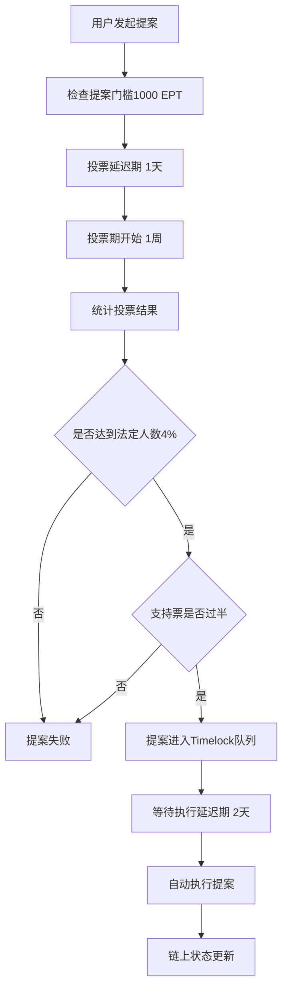

# 第9-10-12节深度解析：从Staking质押到DAO治理的完整生态

## 🎯 核心问题解答：为什么需要投票治理？

### 投票治理的本质：数字化民主决策机制

**投票治理是什么？**
- 投票治理（DAO Governance）是一套让代币持有者共同决策协议发展方向的机制
- 类比：就像公司股东大会，但是完全在链上自动执行，更加透明和公平

**为什么需要投票治理？**

1. **去中心化需求** 🏛️
   - 传统项目：创始团队拥有绝对控制权
   - DAO项目：社区共同拥有和管理，避免单点故障
   - 类比：从"独裁制"到"民主制"的转变

2. **利益一致性** 💰
   - 持有更多代币 = 承担更大风险 = 拥有更大话语权
   - 确保决策者和项目成败利益绑定
   - 类比：房东比租客更关心房子的长期价值

3. **透明度和信任** 🔍
   - 所有提案、投票、执行过程都在链上公开
   - 代码即法律，无法暗箱操作
   - 类比：把公司董事会搬到直播间

4. **可编程治理** ⚙️
   - 投票通过后自动执行，无需人工干预
   - 时间锁机制防止恶意提案
   - 类比：智能合约版的"三权分立"

## 🔗 投票治理与共识机制的关系

**重要区分：技术共识 vs 治理共识**

### 区块链共识机制（技术层）
```
目的：确保交易有效性和网络安全
参与者：矿工/验证者
决策内容：哪个区块是合法的
时间尺度：几秒到几分钟
例子：PoW、PoS、DPoS
```

### DAO治理共识机制（应用层）
```
目的：决定协议参数和发展方向
参与者：代币持有者
决策内容：协议升级、参数调整、资金分配
时间尺度：几天到几周
例子：Compound、Uniswap、MakerDAO治理
```

**两者关系：**
- **依赖关系**：DAO治理依赖区块链共识来保证投票结果的可信性
- **分层架构**：区块链提供基础设施，DAO提供应用层治理
- **互补作用**：技术共识保证系统运行，治理共识决定系统方向

类比理解：
- 区块链共识 = 国家的基础法律制度
- DAO治理 = 公司的股东大会制度

## 📊 第9节：EPTStaking质押挖矿详解

### 核心机制：时间加权的动态奖励

```solidity
// EPTStaking.sol 核心参数
uint256 public constant RATE_SCALE = 1e18;
uint256 public constant ONE_YEAR_SECONDS = 31536000;

uint256 public baseRatePerSecond;      // 基础年化收益率
uint256 public multiplierPerSecond;    // 时长加成系数
uint256 public endTime;                // 质押结束时间
uint256 public totalStaking;           // 总质押量
```

### 奖励计算公式

**基础奖励**：
```
基础奖励 = 质押金额 × 基础年化率 × 质押时长(秒) / 一年秒数
```

**时长加成**：
```
加成奖励 = 质押金额 × 加成系数 × (质押时长)² / (一年秒数)²
```

**总奖励**：
```
总奖励 = 基础奖励 + 加成奖励
```

### 实际案例计算

假设用户质押10,000 EPT代币，锁定365天：
- 基础年化率：5% (0.05 * 1e18)
- 时长加成系数：3% (0.03 * 1e18)

```javascript
// 基础奖励计算
基础奖励 = 10,000 × 0.05 × 365天 / 365天 = 500 EPT

// 加成奖励计算（一年锁定获得满额加成）
加成奖励 = 10,000 × 0.03 × (365/365)² = 300 EPT

// 总奖励
总奖励 = 500 + 300 = 800 EPT (8%年化收益)
```

### Staking与治理的桥梁作用

1. **投票权重来源** 🗳️
   - 质押的EPT代币自动获得投票权
   - 质押时间越长，投票权重可能越大
   - 防止短期投机者影响长期决策

2. **利益绑定机制** 🔒
   - 长期质押者更关心协议健康发展
   - 提案者需要质押代币才能发起提案
   - 恶意治理会损害自己的质押价值

## 🤖 第10节：Keeper自动化服务详解

### Go语言Keeper实现

**核心功能**：
- 监听链上事件，检测是否需要Rebalance
- 自动调用ETF合约的rebalance()函数
- 处理gas费优化和错误重试

```go
// 简化的Keeper服务结构
type KeeperService struct {
    client     *ethclient.Client
    etfContract *contract.ETF
    privateKey  *ecdsa.PrivateKey
    gasPrice    *big.Int
}

// 主要监听循环
func (k *KeeperService) Start() {
    for {
        // 检查是否需要rebalance
        needRebalance := k.checkRebalanceCondition()
        
        if needRebalance {
            // 执行rebalance
            tx, err := k.executeRebalance()
        }
        
        // 等待下一次检查
        time.Sleep(time.Minute * 5)
    }
}
```

### Chainlink Automation集成

**优势**：
- 去中心化执行网络，避免单点故障
- 内置经济激励机制
- 专业的基础设施维护

**实现方式**：
```solidity
// 在ETF合约中添加Chainlink兼容接口
contract ETFv4 is AutomationCompatibleInterface {
    
    function checkUpkeep(bytes calldata)
        external
        view
        returns (bool upkeepNeeded, bytes memory performData)
    {
        // 检查是否需要rebalance
        upkeepNeeded = _needRebalance();
        performData = ""; // 可以传递额外数据
    }
    
    function performUpkeep(bytes calldata) external {
        // 执行rebalance操作
        if (_needRebalance()) {
            rebalance();
        }
    }
}
```

### Keeper的经济模型

1. **Gas费补偿** ⛽
   - Keeper承担rebalance的gas费用
   - 从ETF管理费中获得补偿
   - 超额gas费由协议储备金支付

2. **激励机制** 💎
   - 成功执行rebalance获得奖励
   - 奖励来源：交易手续费分成
   - 失败惩罚：暂时降低执行优先级

## 🏛️ 第12节：投票治理合约架构深度解析

### 三大核心组件

#### 1. Votes Token (EPT)
```solidity
// EPT代币实现投票功能
contract EPTProtocolToken is ERC20, ERC20Votes, ERC20Permit, AccessControl {
    // 投票权委托机制
    function delegate(address delegatee) public override {
        _delegate(_msgSender(), delegatee);
    }
    
    // 获取历史投票权重
    function getPastVotes(address account, uint256 timepoint)
        public view returns (uint256) {
        return super.getPastVotes(account, timepoint);
    }
}
```

#### 2. Governor合约 (ETFGovernor)
```solidity
contract ETFGovernor is
    Governor,
    GovernorSettings,           // 投票参数设置
    GovernorCountingSimple,     // 简单计票：支持/反对/弃权
    GovernorVotes,              // 投票权重来源
    GovernorVotesQuorumFraction,// 法定人数计算
    GovernorTimelockControl     // 时间锁集成
{
    constructor(IVotes _token, TimelockController _timelock)
        Governor("ETFGovernor")
        GovernorSettings(
            1 days,     // 投票延迟：1天
            1 weeks,    // 投票期：1周
            1000e18     // 提案门槛：1000 EPT
        )
        GovernorVotes(_token)
        GovernorVotesQuorumFraction(4) // 法定人数：4%
        GovernorTimelockControl(_timelock)
    {}
}
```

#### 3. Timelock合约
```solidity
// 时间锁确保治理安全
contract TimelockController {
    uint256 public minDelay; // 最小延迟时间
    
    // 提案通过后必须等待minDelay才能执行
    function execute(
        address target,
        uint256 value,
        bytes calldata data,
        bytes32 predecessor,
        bytes32 salt
    ) external payable {
        require(isReadyForExecution(id), "TimelockController: operation is not ready");
        _execute(target, value, data);
    }
}
```

### 完整治理流程



### 实际治理案例

**提案示例：调整ETF管理费率**
```solidity
// 1. 发起提案
function proposeFeeCo() external {
    address[] memory targets = new address[](1);
    uint256[] memory values = new uint256[](1);
    bytes[] memory calldatas = new bytes[](1);
    
    targets[0] = address(etfContract);
    values[0] = 0;
    calldatas[0] = abi.encodeWithSignature("setManagementFee(uint256)", 50); // 0.5%
    
    propose(targets, values, calldatas, "Proposal: Reduce management fee to 0.5%");
}
```

**投票过程**：
1. 代币持有者使用`castVote(proposalId, support)`投票
2. support: 0=反对, 1=支持, 2=弃权
3. 投票权重 = 提案创建时的代币余额
4. 支持委托：可以委托给专业投票者

**安全机制**：
- **快照机制**：防止投票期间转移代币刷票
- **时间锁**：给社区时间发现恶意提案
- **紧急暂停**：Guardian角色可以取消恶意提案

## 🚀 三个模块的部署指导

### 第一步：部署Staking合约

```bash
# 1. 编译合约
forge build

# 2. 部署EPTStaking
forge create src/EPTStaking.sol:EPTStaking \
    --constructor-args \
    "<EPT_TOKEN_ADDRESS>" \
    "50000000000000000" \
    "30000000000000000" \
    "<END_TIMESTAMP>" \
    --private-key $PRIVATE_KEY \
    --rpc-url $RPC_URL

# 3. 向Staking合约转入奖励代币
cast send <STAKING_ADDRESS> \
    --value <REWARD_AMOUNT> \
    --private-key $PRIVATE_KEY \
    --rpc-url $RPC_URL
```

### 第二步：部署治理系统

```bash
# 1. 部署Timelock
forge create src/TimelockController.sol:TimelockController \
    --constructor-args \
    "172800" \
    "[]" \
    "[]" \
    "<ADMIN_ADDRESS>" \
    --private-key $PRIVATE_KEY

# 2. 部署Governor
forge create src/ETFGovernor.sol:ETFGovernor \
    --constructor-args \
    "<EPT_TOKEN_ADDRESS>" \
    "<TIMELOCK_ADDRESS>" \
    --private-key $PRIVATE_KEY

# 3. 配置Timelock权限
cast send <TIMELOCK_ADDRESS> "grantRole(bytes32,address)" \
    "<EXECUTOR_ROLE>" \
    "<GOVERNOR_ADDRESS>" \
    --private-key $PRIVATE_KEY
```

### 第三步：配置Keeper服务

**Go Keeper部署**：
```bash
# 1. 创建项目
mkdir etf-keeper && cd etf-keeper
go mod init etf-keeper

# 2. 安装依赖
go get github.com/ethereum/go-ethereum
go get github.com/joho/godotenv

# 3. 生成合约绑定
abigen --abi=ETF.abi --pkg=contract --type=ETF --out=ETF.go

# 4. 配置环境变量
echo "PRIVATE_KEY=your_private_key" > .env
echo "RPC_URL=https://mainnet.infura.io/v3/your_key" >> .env
echo "ETF_CONTRACT=0x..." >> .env

# 5. 运行服务
go run main.go
```

**Chainlink Automation设置**：
1. 访问 https://automation.chain.link/
2. 连接钱包并选择网络
3. 注册新的Upkeep，输入ETF合约地址
4. 充值LINK代币作为执行费用
5. 设置触发条件和执行频率

## 💡 系统集成与最佳实践

### 权限管理架构
```
Admin (多签钱包)
├── ETF合约 (Timelock控制)
├── Staking合约 (Admin管理参数)
├── Governor合约 (社区治理)
└── Keeper服务 (自动化执行)
```

### 治理参数推荐
```solidity
// 新项目启动建议
投票延迟: 1天       // 给提案者时间准备
投票期: 3-7天       // 平衡参与度和效率
提案门槛: 总供应量0.1-1%  // 防止垃圾提案
法定人数: 总供应量3-10%   // 确保足够参与度
时间锁延迟: 1-7天   // 应急响应时间

// 成熟项目建议
投票延迟: 2-3天
投票期: 1-2周
提案门槛: 总供应量0.5-2%
法定人数: 总供应量5-15%
时间锁延迟: 2-14天
```

### 安全注意事项

1. **多签钱包控制** 🔐
   - 初期由多签钱包控制关键权限
   - 逐步将权限转移给DAO治理
   - 保留紧急暂停功能

2. **参数调优** ⚙️
   - 根据社区参与度调整治理参数
   - 监控提案质量和投票参与率
   - 定期审查和优化流程

3. **经济安全** 💰
   - 确保Keeper有足够的gas费储备
   - 监控质押奖励的可持续性
   - 建立协议储备金应对极端情况

## 🎊 总结：完整的DeFi治理生态

通过第9-10-12节的学习，我们构建了一个完整的去中心化治理生态：

1. **Staking质押** - 为用户提供收益，为治理提供投票权重
2. **Keeper自动化** - 确保协议正常运行，减少人工干预
3. **投票治理** - 让社区共同决策，实现真正的去中心化

这三个模块相互配合，形成了一个自运行、自治理、自激励的DeFi协议生态系统。

**核心价值**：
- 💎 **经济激励**：质押获得收益和治理权
- 🤖 **自动化**：Keeper确保系统稳定运行  
- 🗳️ **民主治理**：社区共同决定协议未来
- 🔒 **安全透明**：链上执行，代码开源

这就是现代DeFi协议的标准架构，也是区块链技术实现"代码即法律"理念的最佳实践！